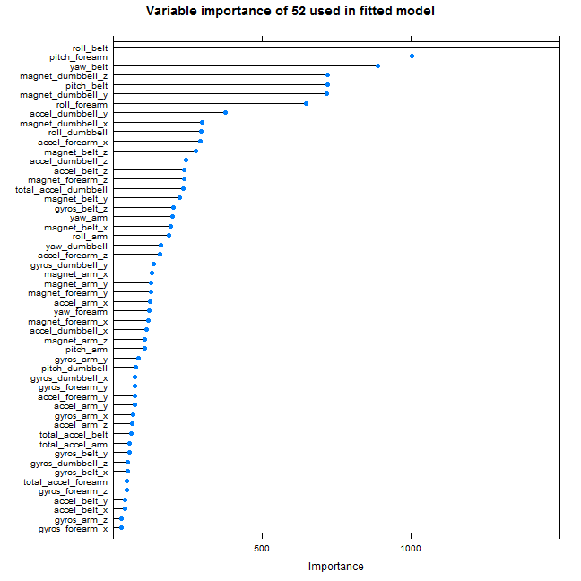

Reproducing Activity Recognition of Weight Lifting Exercises
============================================================

This exercise for the Coursera [Practical Machine Learning](https://www.coursera.org/course/predmachlearn) course aims to predict types of weight lifting exercises from measurements of sensors.

The original data comes from:

*[Qualitative Activity Recognition of Weight Lifting Exercises](http://groupware.les.inf.puc-rio.br/public/papers/2013.Velloso.QAR-WLE.pdf)* 
Velloso, E.; Bulling, A.; Gellersen, H.; Ugulino, W.; Fuks, H. Qualitative Activity Recognition of Weight Lifting Exercises. Proceedings of 4th Augmented Human (AH) International Conference in cooperation with ACM SIGCHI (Augmented Human'13) . Stuttgart, Germany: ACM SIGCHI, 2013.

Data preparation
----------------

First R needs to read the training and test data provided in the correct location.


```r
setwd("C:/Users/HB/Weight_Lifting/")
datalocation <- "F:/Documents/Coursera/Practical Machine Learning/"
training <- read.csv(paste0(datalocation, "pml-training.csv"))
testing <- read.csv(paste0(datalocation, "pml-testing.csv"))
```


Cleaning the training data involves removing any variables which have missing values, any variables which are not-numeric (except for the `classe` variable, which is what is being predicted) and the initial four variables `X`, `raw_timestamp_part_1`, `raw_timestamp_part_2`, and `num_window` which just give an order to the observations and may cause leakage if retained.  See how the dimension of the training dataframe reduces at each step:


```r
dim(training)
```

```
## [1] 19622   160
```

```r
trainingnotNA <- training[, colSums(is.na(training)) == 0]
dim(trainingnotNA)
```

```
## [1] 19622    93
```

```r
trainingnumeric <- trainingnotNA[, sapply(trainingnotNA, is.numeric)]
dim(trainingnumeric)
```

```
## [1] 19622    56
```

```r
trainingtouse <- cbind(trainingnumeric[, -(1:4)])
dim(trainingtouse)
```

```
## [1] 19622    52
```


The following numeric variables will be used retained to training and predict `classe`:


```r
variablestouse <- names(trainingtouse)
variablestouse
```

```
##  [1] "roll_belt"            "pitch_belt"           "yaw_belt"            
##  [4] "total_accel_belt"     "gyros_belt_x"         "gyros_belt_y"        
##  [7] "gyros_belt_z"         "accel_belt_x"         "accel_belt_y"        
## [10] "accel_belt_z"         "magnet_belt_x"        "magnet_belt_y"       
## [13] "magnet_belt_z"        "roll_arm"             "pitch_arm"           
## [16] "yaw_arm"              "total_accel_arm"      "gyros_arm_x"         
## [19] "gyros_arm_y"          "gyros_arm_z"          "accel_arm_x"         
## [22] "accel_arm_y"          "accel_arm_z"          "magnet_arm_x"        
## [25] "magnet_arm_y"         "magnet_arm_z"         "roll_dumbbell"       
## [28] "pitch_dumbbell"       "yaw_dumbbell"         "total_accel_dumbbell"
## [31] "gyros_dumbbell_x"     "gyros_dumbbell_y"     "gyros_dumbbell_z"    
## [34] "accel_dumbbell_x"     "accel_dumbbell_y"     "accel_dumbbell_z"    
## [37] "magnet_dumbbell_x"    "magnet_dumbbell_y"    "magnet_dumbbell_z"   
## [40] "roll_forearm"         "pitch_forearm"        "yaw_forearm"         
## [43] "total_accel_forearm"  "gyros_forearm_x"      "gyros_forearm_y"     
## [46] "gyros_forearm_z"      "accel_forearm_x"      "accel_forearm_y"     
## [49] "accel_forearm_z"      "magnet_forearm_x"     "magnet_forearm_y"    
## [52] "magnet_forearm_z"
```


Some R libraries are needed to perform Random Forest machine learning.


```r
library(caret)
```

```
## Loading required package: lattice
## Loading required package: ggplot2
```

```r
library(randomForest)
```

```
## randomForest 4.6-7
## Type rfNews() to see new features/changes/bug fixes.
```

```r
library(e1071)
```


Model fitting 
-------------

The original analysis by Velloso *et al* states it used a Random Forest approach, so this analysis does too. The model fitting uses the `caret` package to apply the Random Forest method to train the machine learning model using what remains of the training data after cleaning. This takes some time and uses a large amount of memory, at least on this machine.      

It both uses 3-fold cross validation and witholds about a fifth of the training data for further validation, to give an estimate of out-of-sample error. Setting the seed allows reproducability.


```r
set.seed(2014)
intrain <- createDataPartition(y = training$classe, p = 0.8, list = FALSE)
fitControl <- trainControl(method = "cv", number = 3)
modelFit <- train(classe ~ ., method = "rf", trControl = fitControl, data = training[intrain, 
    c(variablestouse, "classe")])
```


Results
-------

The results of the model fit suggests that it has a perfect in-model fit, producing a confusion matrix where all values are on the diagonal.

The 3-fold cross-validation suggests that out-of-model predictions should be almost perfect too.  


```r
print(modelFit)
```

```
## Random Forest 
## 
## 15699 samples
##    52 predictors
##     5 classes: 'A', 'B', 'C', 'D', 'E' 
## 
## No pre-processing
## Resampling: Cross-Validated (3 fold) 
## 
## Summary of sample sizes: 10465, 10467, 10466 
## 
## Resampling results across tuning parameters:
## 
##   mtry  Accuracy  Kappa  Accuracy SD  Kappa SD
##   2     1         1      2e-04        3e-04   
##   30    1         1      7e-04        8e-04   
##   50    1         1      0.004        0.005   
## 
## Accuracy was used to select the optimal model using  the largest value.
## The final value used for the model was mtry = 27.
```

```r
mean(predict(modelFit, training[intrain, ]) == training[intrain, ]$classe)
```

```
## [1] 1
```

```r
sum(predict(modelFit, training[intrain, ]) == training[intrain, ]$classe)
```

```
## [1] 15699
```

```r
sum(predict(modelFit, training[intrain, ]) != training[intrain, ]$classe)
```

```
## [1] 0
```

```r
confusionMatrix(predict(modelFit, training[intrain, ]), training[intrain, ]$classe)
```

```
## Confusion Matrix and Statistics
## 
##           Reference
## Prediction    A    B    C    D    E
##          A 4464    0    0    0    0
##          B    0 3038    0    0    0
##          C    0    0 2738    0    0
##          D    0    0    0 2573    0
##          E    0    0    0    0 2886
## 
## Overall Statistics
##                                 
##                Accuracy : 1     
##                  95% CI : (1, 1)
##     No Information Rate : 0.284 
##     P-Value [Acc > NIR] : <2e-16
##                                 
##                   Kappa : 1     
##  Mcnemar's Test P-Value : NA    
## 
## Statistics by Class:
## 
##                      Class: A Class: B Class: C Class: D Class: E
## Sensitivity             1.000    1.000    1.000    1.000    1.000
## Specificity             1.000    1.000    1.000    1.000    1.000
## Pos Pred Value          1.000    1.000    1.000    1.000    1.000
## Neg Pred Value          1.000    1.000    1.000    1.000    1.000
## Prevalence              0.284    0.194    0.174    0.164    0.184
## Detection Rate          0.284    0.194    0.174    0.164    0.184
## Detection Prevalence    0.284    0.194    0.174    0.164    0.184
## Balanced Accuracy       1.000    1.000    1.000    1.000    1.000
```


Considering the fifth of training data observations withheld for validation, the suggested out-of model error is still small, but not quite so perfect. with an accuracy of over 99.5%.


```r
mean(predict(modelFit, training[-intrain, ]) == training[-intrain, ]$classe)
```

```
## [1] 0.9957
```

```r
sum(predict(modelFit, training[-intrain, ]) == training[-intrain, ]$classe)
```

```
## [1] 3906
```

```r
sum(predict(modelFit, training[-intrain, ]) != training[-intrain, ]$classe)
```

```
## [1] 17
```

```r
confusionMatrix(predict(modelFit, training[-intrain, ]), training[-intrain, 
    ]$classe)
```

```
## Confusion Matrix and Statistics
## 
##           Reference
## Prediction    A    B    C    D    E
##          A 1115    3    0    0    0
##          B    0  753    1    0    0
##          C    0    3  681    6    0
##          D    0    0    2  637    1
##          E    1    0    0    0  720
## 
## Overall Statistics
##                                         
##                Accuracy : 0.996         
##                  95% CI : (0.993, 0.997)
##     No Information Rate : 0.284         
##     P-Value [Acc > NIR] : <2e-16        
##                                         
##                   Kappa : 0.995         
##  Mcnemar's Test P-Value : NA            
## 
## Statistics by Class:
## 
##                      Class: A Class: B Class: C Class: D Class: E
## Sensitivity             0.999    0.992    0.996    0.991    0.999
## Specificity             0.999    1.000    0.997    0.999    1.000
## Pos Pred Value          0.997    0.999    0.987    0.995    0.999
## Neg Pred Value          1.000    0.998    0.999    0.998    1.000
## Prevalence              0.284    0.193    0.174    0.164    0.184
## Detection Rate          0.284    0.192    0.174    0.162    0.184
## Detection Prevalence    0.285    0.192    0.176    0.163    0.184
## Balanced Accuracy       0.999    0.996    0.996    0.995    0.999
```


There is also information about the importance of the different variables used for prediction, which can be seen on this plot. Belt measurements seem to tend to be more important while gyro measurements are often relatively less important. 


```r
plot(varImp(modelFit, scale = FALSE), xlim = c(0, 1500), main = "Variable importance of 52 used in fitted model")
```

 


Prediction of test set
----------------------

A fitted model allows prediction from the test set. The values need to be converted from a factor variable vector to characters before submission.


```r
answers <- as.character(predict(modelFit, testing))
answers
```

```
##  [1] "B" "A" "B" "A" "A" "E" "D" "B" "A" "A" "B" "C" "B" "A" "E" "E" "A"
## [18] "B" "B" "B"
```


Unlike the validation set with over 3900 observations, the 20 observations in the provided test set are not sufficient to see precisely how close the out-of-model accuracy is in fact to 100% as one error would drop the result to 95%.  In fact, all 20 predictions were subsequently validated as correct. 
